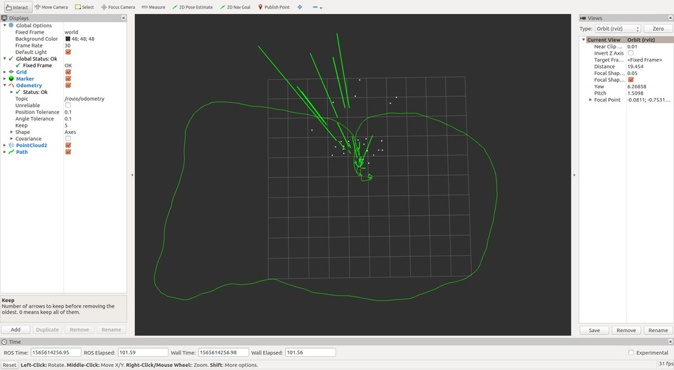

# rovio_cg

Modified version of ROVIO (commit 3389c2a  on Dec 19, 2017).

* **[ROVIO](https://github.com/ethz-asl/rovio)**: Robust Visual Inertial Odometry
* Papers
  - *Robust Visual Inertial Odometry Using a Direct EKF-Based Approach*
  - *Iterated extended Kalman filter based visual-inertial odometry using direct photometric feedback*

# Dependencies

* **[kindr](https://github.com/ethz-asl/kindr)** (Kinematics and Dynamics for Robotics)

* **[lightweight_filtering](https://bitbucket.org/bloesch/lightweight_filtering)**: provides basic functionalities for implementing EKF and UKF filters
  ```sh
  mkdir -p ws_rovio/src
  cd ws_rovio/src
  git clone https://github.com/cggos/rovio_cg.git
  wstool init ./ rovio_cg/dependencies.rosinstall # lightweight_filtering
  ```

# Build

* without opengl scene
  ```sh
  catkin build rovio --cmake-args -DCMAKE_BUILD_TYPE=Release
  # or
  catkin_make -DCMAKE_BUILD_TYPE=Release -j2
  ```

* with opengl scene
  ```sh
  sudo apt install freeglut3-dev libglew-dev # dependencies

  catkin build rovio --cmake-args -DCMAKE_BUILD_TYPE=Release -DMAKE_SCENE=ON
  # or
  catkin_make -DCMAKE_BUILD_TYPE=Release -j2 -DMAKE_SCENE=ON
  ```

# Run

* with Euroc Datasets
  ```sh
  roslaunch rovio rovio_node_euroc.launch [rviz:=true]
  rosbag play MH_01_easy.bag
  ```

* with MYNTEYE-S1030
  ```sh
  roslaunch rovio rovio_node_mynteye.launch [rviz:=true]
  ```
  

# Notes

* Camera matrix and distortion parameters should be provided by a yaml file or loaded through rosparam
* The cfg/rovio.info provides most parameters for rovio. The camera extrinsics qCM (quaternion from IMU to camera frame, Hamilton-convention) and MrMC (Translation between IMU and Camera expressed in the IMU frame) should also be set there. They are being estimated during runtime so only a rough guess should be sufficient.
* Especially for application with little motion fixing the IMU-camera extrinsics can be beneficial. This can be done by setting the parameter doVECalibration to false. Please be carefull that the overall robustness and accuracy can be very sensitive to bad extrinsic calibrations.
